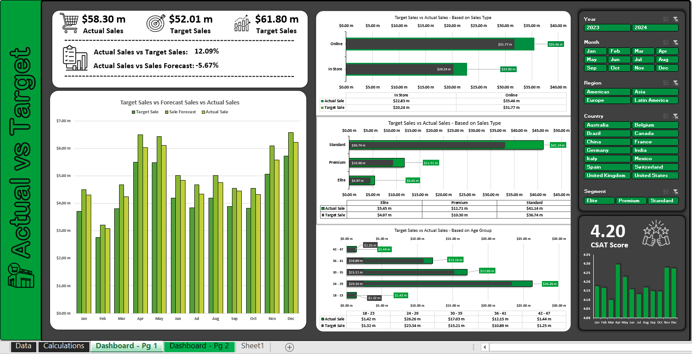
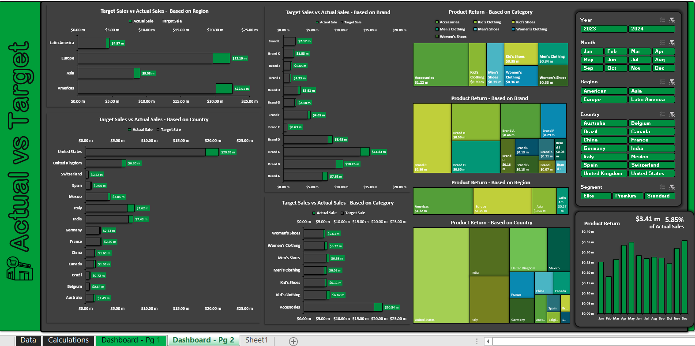

# 📊 Excel Sales & Marketing Dashboards

> Interactive Excel dashboards for Sales Performance Analysis — Actual vs Target tracking with dynamic slicers, KPIs, and multi-dimensional breakdowns.

---

## 🖼️ Preview

### Dashboard — Page 1 · KPIs & Trend Analysis


### Dashboard — Page 2 · Actual vs Target & Product Return


---

## 📁 Files

| File | Description | Download Raw File |
|------|-------------|--------------|
| `Marketing___Sales_Dashboards.xlsx` | Main dashboard — Actual vs Target Sales | [**Download**](https://github.com/ermirhaxhia/excel-sales-dashboards/raw/main/Sales%20dashboards%20&%20marketing%20insights.xlsx) |

---

## 📌 Features

- **KPI Cards** — Actual Sales ($58.30m), Target Sales ($52.01m), Sales Forecast ($61.80m)
- **Variance Tracking** — Actual vs Target (+12.09%) and vs Forecast (-5.67%)
- **Dynamic Slicers** — Filter by Year, Month, Region, Country, Segment
- **Multi-dimensional Charts:**
  - Target vs Actual by Region (Americas, Asia, Europe, Latin America)
  - Target vs Actual by Country (15 countries)
  - Target vs Actual by Brand (A–L)
  - Target vs Actual by Category (Men's/Women's Clothing & Shoes, Kid's)
  - Target vs Actual by Sales Type (Online vs In-Store)
  - Target vs Actual by Customer Segment (Elite, Premium, Standard)
  - Target vs Actual by Age Group (18–47)
- **Product Return Analysis** — by Brand, Region, Country
- **CSAT Score** — 4.20 with trend visualization
- **Treemap Visuals** — Product return distribution

---

## 🛠️ Tools & Techniques

- Microsoft Excel 
- Dynamic slicers with cross-filtering
- Dark theme custom design

---

## 📂 Workbook Structure

```
📗 Workbook
├── 📄 Data          ← Raw dataset
├── 📄 Calculations  ← Intermediate measures 
├── 📄 Dashboard - Pg 1  ← KPIs, Trends, Segments
└── 📄 Dashboard - Pg 2   ← Regional & Brand analysis
```

---

## 📥 How to Use

1. Download the `.xlsx` file
2. Open with **Microsoft Excel** (2016 or later recommended)
3. Navigate to **Dashboard - Pg 1** or **Dashboard - Pg 2**
4. Use the **slicers on the right panel** to filter by Year, Month, Region, Country, Segment
5. All charts update dynamically

---

## 👤 Author

**Ermir Haxhia** — Applied Mathematics · Data Analysis · Programming  
🌐 [Portfolio](https://ermir-haxhia.vercel.app) · [LinkedIn](https://www.linkedin.com/in/ermir-haxhia-b988212b5) · [GitHub](https://github.com/ermirhaxhia)

